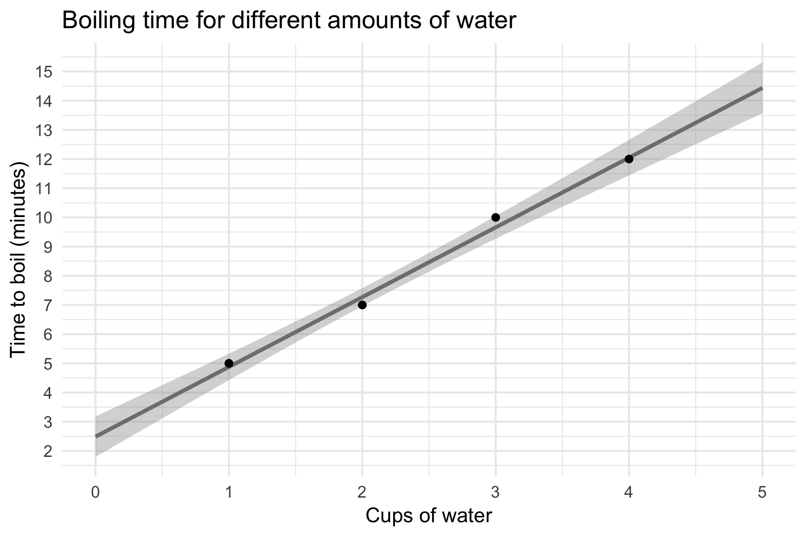

# How long will it take for different amounts of water to boil?

Satisfying some kid curiosity with a simple experiment.

# Steps we followed

We decided to do two trials for each amount of water, but got bored towards the end.

# Data we collected

Digital version in [boiling_times.csv](boiling_times.csv).

# Results

It looks like the water heats up slightly faster in the beginning and then it slows down as it gets close to boiling. The water boiled slightly below 212F according to our thermometer. Maybe our thermometer isn't measuring things correctly?

It looks like doubling the amount of water just about doubles the boiling time.
